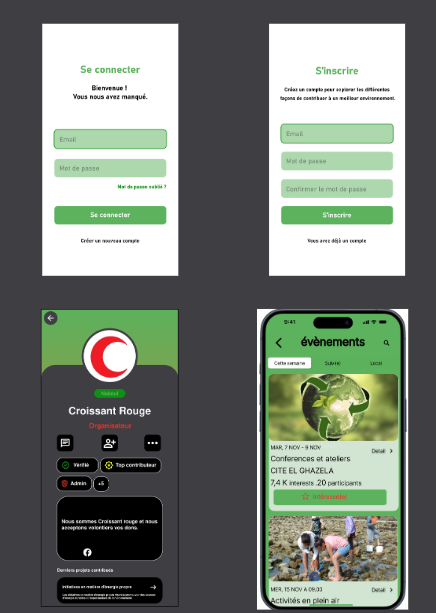
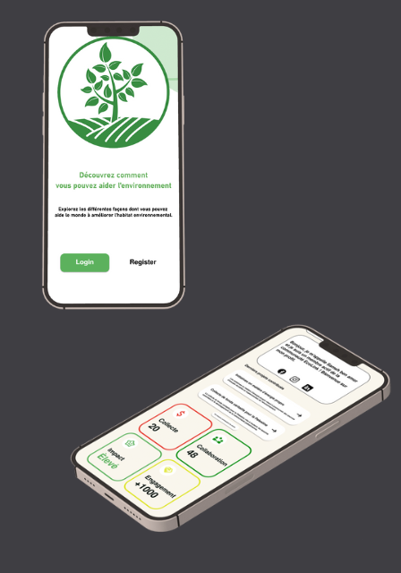

<p align="center">
    
</p>

# Ecolink - Empowering Environmental Engagement

## Overview
Ecolink is an **Android mobile app** developed with **Kotlin**, designed to empower users to actively contribute to environmental causes. 

Developed by:
- **Riahi Seif**
- **Houssem Ben Mabrouk**
- **Daly Tlili**
- **Mohamed Ajili**
- **Sameh Ben Amor**

Ecolink offers multiple **modules** to engage users in sustainable activities.

---
## Modules

### User
- Create profiles
- Customize preferences
- Manage engagement in environmental activities

### Tracking and Rewards
- Track environmental impact
- Earn rewards for sustainable actions

### Blogs
- Stay updated with environmental news
- Share stories and ecological insights

### Events
- Participate or organize eco-friendly events
- Connect with community initiatives

### Lesson
- Access educational content on sustainability
- Engage in informative courses

### Store
- Discover and purchase eco-friendly products

---
## App Concept
Ecolink introduces a unique approach where users can choose between:

- **Contributor:** Actively participates in environmental initiatives.
- **Organizer:** Plans and executes eco-friendly events.

Additionally, Ecolink enables users to contribute to **Kickstarter projects** dedicated to environmental causes, fostering collaboration towards a **sustainable future**.

<p align="center">
    
    
</p>

---
## Getting Started

### Installation
Clone the repository:

```bash
git clone https://github.com/seifriahi/Ecolink-app.git
```

Open the project in **Android Studio**, then build and run the app on your **Android device** or **emulator**.

---
## Contributing
We welcome contributions to enhance Ecolink and make it an even more impactful tool for environmental advocacy. Check out our [Contribution Guidelines](CONTRIBUTING.md) to get started.

---
## License
Ecolink is licensed under the **[MIT License](LICENSE)**. See the [LICENSE](LICENSE) file for more details.

---
## Contact
For inquiries and support, reach out to the **Ecolink team**:

| Team Members       |
|----------------------|
| Riahi Seif          |
| Houssem Ben Mabrouk |
| Daly Tlili          |
| Mohamed Ajili       |
| Sameh Ben Amor      |

---
